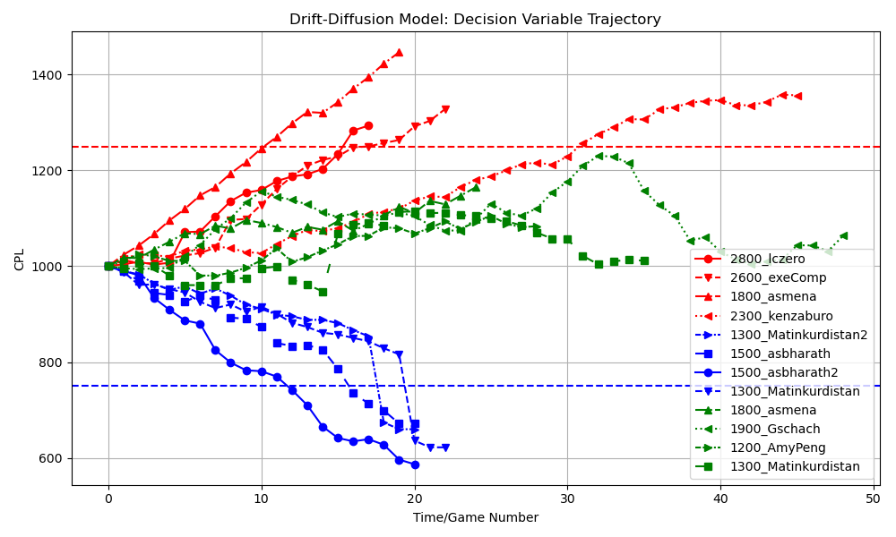
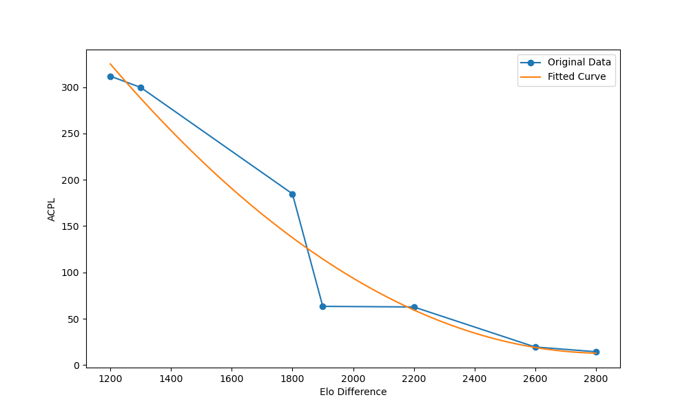

# DDCPS
> Replacing ELO with Drift Diffusion Model (DDM) for Assessing Chess Player Skill Levels: A New Approach to Performance Evaluation

  

  

## 📜 Introduction

Traditional chess rating systems, such as Elo, have limitations in accurately assessing player skill levels. They struggle to capture individual move quality and require numerous games to stabilize ratings. To address these issues, we introduce DDCPS (Drift Diffusion Chess Player Skill Evaluation), a novel approach inspired by the Drift Diffusion Model (DDM). DDCPS evaluates player skill based on move quality, offering a more dynamic and precise assessment.

## 🛠️ Features

- Move-by-move analysis: Uses centipawn loss (CPL) changes to track real-time performance.
- Fast skill evaluation: Determines player ability in significantly fewer games than Elo.
- Convergence properties: Retains Elo’s stability while improving early-stage rating accuracy.

## 📊 Methodology

1. Drift Rate Calculation: Determines player skill in real-time using a customized activation function.
2. Boundary Setting: Defines decision boundaries for skill differentiation.
3. Discrete Time Representation: Tracks each move as a discrete step to model game progress.

## 🔬 Experiments & Results

- Player Skill Evaluation: DDCPS successfully distinguishes player skill gaps within 20-30 games.
- Convergence Property: The model stabilizes player ratings over time, similar to Elo.
